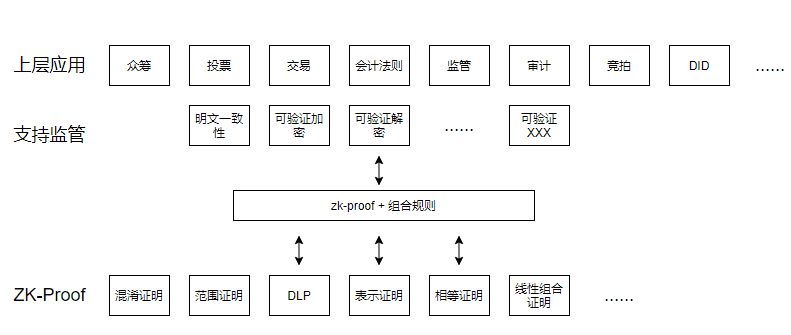

## 一、预备知识

公开、恶意的系统 -> 恶意安全的模型

**1.诚实：**

自证明：每过个红绿灯，拿到一个奖励，最后把奖励都拿出来自己证明没违规

检测是否违规：过了几个红绿灯后翻摄像头看你违规没违规

**2.零知识证明的非交互式向交互式转换：**

<!--1-->Lecture 1: Honest Verifier ZK and Fiat-Shamir

<!--2-->Amos Fiat and Adi Shamir. How to prove yourself: Practical solutions to iden-
tification and signature problems. In CRYPTO ’86, volume 263 of LNCS, pages
186–194, 1986.

https://asecuritysite.com//encryption/fiat2

**3.交易路径隐私**

这个学会，用以研究混淆路径，而且零知识证明协议设计就easy了

<!--3-->Quisquis

**4.zcash**

好好学习下，看看和我们的链对比到底有什么不同。了解下原理，看看它为啥慢，又不安全。

https://z.cash/

**5.bulletproof**

- 学习原理
- 用椭圆曲线代码实现
- 查找开源库，看是否有混淆路径的示例
- 研究用bulletproof完成混淆路径
- 应用到工程代码上组件化
- Rust实现： https://github.com/dalek-cryptography/bulletproofs 
- <!--4-->Bulletproofs: ShVort Proofs for Confidential Transactions and More

**6.DKG分布式密钥产生技术**

<!--5-->Secure Distributed Key Generation for Discrete-Log Based Cryptosystems

**7.零知识证明**

<!--6-->Confidential_Distributed_Ledgers_for_Online_Syndicated_Lending__1_ (5)_yqG(禁止外传)

- 混淆证明
- 范围证明
- DLP
- 表示证明
- 相等证明
- 线性组合证明

**8.PedersenCommitment**

<!--6-->Confidential_Distributed_Ledgers_for_Online_Syndicated_Lending__1_ (5)_yqG(禁止外传)

承诺满足条件：绑定性、隐私性

承诺有多种形式：Pederson承诺 / H( m , r ) - 用于DID

## 二、实现方案

#### 2.1 架构

#### 2.2 算法方案

以椭圆曲线为困难问题，实现一系列的zk-proof

#### 2.3 技术方案

1.在底层融入所有的zk-proof，零知识证明以及各种承诺、交易的数据结构：golang或rust实现，并入底层平台的基础密码算法中

2.在用户发起交易时，提供可选择的定制接口，在构建交易的时候可以选择使用支持哪种应用的交易、链自动为其生成承诺、并生成其需要的几种证明（暂时只实现我们想到的几种应用场景，直接对应到组合规则和proofs）

3.不同的类型的交易（比如 众筹、投票等等）可以存在于同一个链上

#### 2.4 任务

**1.预备知识学习**

- 学习bulletproof
- 学习刘老师的文章
- 尝试学习quisquis
- 等等其他知识自己扩展学习

**2.零知识证明算法**

- 原有的零知识证明算法用椭圆曲线重写：相等、格式正确、会计平衡
- 实现范围证明、DLP、表示证明
- 尝试基于bulletproof的混淆证明的构建
- 基于椭圆曲线的承诺

**3.zcash**

- zcash的密码算法
- zcash有什么不安全的地方、为什么效率低
- zcash的交易结构、类UTXO模型
- zcash的技术实现
- zcash和我们在密码、底层、技术上的区别
- 对比zcash，我们在底层平台上具体的区别、劣势、好处是什么

**4.混淆证明和bulletproof**

- 混淆证明的理念
- bulletproof的原理
- bulletproof的开源代码
- bulletproof的应用示例
- bulletproof和混淆证明的关系？是否已经有混淆证明的实现？
- 参考bulletproof实现混淆证明

**5.zkproof 与组合规则**

- 在哪里提到了zkproof的组合规则
- zkproof的组合规则详细整理
- zkproof组合规则的代码实现
- zkproof组合规则的代码调试
- zkproof组合规则的RPC API
- 利用zkproof组合规则的API尝试建立应用
- 探索zkproof组合规则的更多可能、实现、和其他前言进展

**6.应用搭建**

- 在改进的链上进行应用搭建
- 测试改进的链
- 对改进的链进行试验、测试各种应用指标：TPS ， 开销等
- 尝试拿到其他地方的试用、应用证明
- 文案编写
- 把链搭建到云上调试
- 新的钱包和浏览器构建